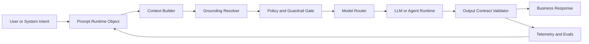

# Architecture

The prompt control plane separates business intent, enterprise context, model execution, guardrails, and observability into explicit runtime objects.

## Runtime Layers

| Layer | Responsibility |
| --- | --- |
| Prompt template | Versioned instructions and business intent |
| Context builder | Runtime data assembly from trusted systems |
| Grounding resolver | Retrieval, citations, and source constraints |
| Policy gate | Allowed tools, guardrails, escalation rules |
| Model router | Provider selection, fallback, cost/performance constraints |
| Output validator | Structured output, safety checks, schema validation |
| Telemetry envelope | Trace attributes, prompt version, source IDs, tool calls, eval results |

## Design Principle

Prompts in enterprise systems are not isolated strings. They are operational control objects that define how AI systems access context, call tools, route to models, satisfy policy, and produce auditable outputs.

